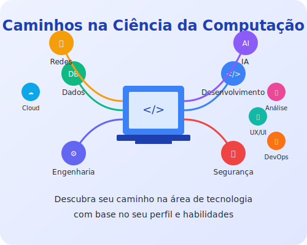

# Teste Vocacional para Ciência da Computação

[](https://lucasdoreac.github.io/teste-vocacional-computacao/)
[](LICENSE)

Um teste vocacional interativo para ajudar calouros e iniciantes em Ciência da Computação a descobrir quais áreas da TI combinam melhor com seu perfil, habilidades e interesses.

🌐 **[Acessar o Teste Vocacional](https://lucasdoreac.github.io/teste-vocacional-computacao/)**



## 🎯 Objetivo

Este projeto foi criado para ajudar estudantes de Ciência da Computação, especialmente calouros sem experiência prévia, a:

- Descobrir áreas da TI que combinam com seu perfil
- Conhecer tecnologias atualizadas (2025) para cada área
- Encontrar recursos gratuitos para aprendizado
- Identificar projetos práticos para começar

## 🧠 Como Funciona

O teste consiste em 30 perguntas cuidadosamente elaboradas para avaliar interesses, habilidades e preferências de trabalho. Cada resposta tem pesos específicos para diferentes áreas da TI.

Ao final, o algoritmo:
1. Calcula sua compatibilidade com cada área
2. Gera um gráfico de resultados
3. Fornece informações detalhadas sobre as áreas mais compatíveis
4. Recomenda recursos de aprendizado e projetos para iniciantes

## 🔍 Áreas Abordadas

O teste abrange 10 áreas principais da TI:

1. Desenvolvimento de Software
2. Inteligência Artificial
3. Cibersegurança
4. Banco de Dados
5. Redes de Computadores
6. Engenharia de Software
7. Análise de Dados
8. UX/UI Design
9. DevOps
10. Computação em Nuvem

## 💻 Tecnologias Utilizadas

- HTML5, CSS3 e JavaScript puro
- Font Awesome para ícones
- Google Fonts (Poppins e Roboto Mono)
- Chart.js para visualizações
- jsPDF para geração de PDF dos resultados

## 🚀 Como Usar

1. Acesse o [site do teste](https://lucasdoreac.github.io/teste-vocacional-computacao/)
2. Leia a introdução e clique em "Iniciar Teste Vocacional"
3. Responda às 30 perguntas selecionando a opção que melhor te descreve
4. Veja seus resultados e explore as informações detalhadas sobre cada área
5. Salve ou compartilhe seus resultados

## 🧪 Local de Testes

Se quiser executar o projeto localmente:

1. Clone o repositório:
```
git clone https://github.com/Lucasdoreac/teste-vocacional-computacao.git
```

2. Abra o arquivo `index.html` em seu navegador ou use um servidor local como o Live Server do VS Code.

## 🤝 Como Contribuir

Contribuições são bem-vindas! Você pode ajudar:

- Adicionando novas perguntas ou refinando as existentes
- Atualizando informações sobre tecnologias e recursos
- Melhorando o design e a experiência do usuário
- Reportando bugs ou sugerindo melhorias

Para contribuir:
1. Faça um fork do projeto
2. Crie uma branch para sua feature (`git checkout -b feature/nova-feature`)
3. Faça commit das alterações (`git commit -m 'Adiciona nova feature'`)
4. Envie para o GitHub (`git push origin feature/nova-feature`)
5. Abra um Pull Request

## 📝 Licença

Este projeto está sob a licença MIT. Veja o arquivo [LICENSE](LICENSE) para mais detalhes.

## 📧 Contato

Para sugestões, dúvidas ou feedback, abra uma [issue](https://github.com/Lucasdoreac/teste-vocacional-computacao/issues) no GitHub.

---

Desenvolvido com ❤️ para apoiar calouros no início de sua jornada em TI.